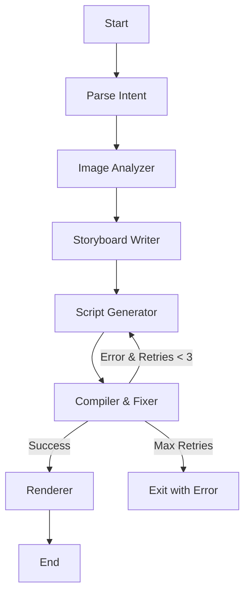

# FotoOwl AI - Image-to-Video Multiagent Pipeline

## Overview

A LangGraph-powered multiagent system that transforms event photos into personalized video reels using AI. The pipeline analyzes images, creates storyboards, generates Remotion scripts, and renders videos automatically.

## Architecture

### LangGraph Flow



### Five Agents

1. **Image Analyzer** - Analyzes images using vision model (GPT-4o-mini)
2. **Storyboard Writer** - Creates structured storyboard with RAG-retrieved style guides
3. **Script Generator** - Generates Remotion TypeScript code with RAG-retrieved API docs
4. **Compiler & Fixer** - Compiles script and fixes errors with retry loop (max 3 attempts)
5. **Renderer** - Triggers final video render

## Model Selection Rationale

All models use **Google Gemini** (free tier via [Google AI Studio](https://aistudio.google.com/apikey)).

| Agent | Model | Reasoning |
|-------|-------|-----------|
| Intent Parser | gemini-2.0-flash | Fast, cheap, structured output — simple parsing task |
| Image Analyzer | gemini-2.0-flash | Native multimodal vision, free, handles 10 images well |
| Storyboard Writer | gemini-2.0-flash | Strong reasoning for narrative sequencing |
| Script Generator | gemini-2.0-flash | Good code generation, handles Remotion TSX reliably |
| Compiler & Fixer | gemini-2.0-flash | Error pattern matching, targeted fix with RAG context |

> `gemini-2.0-flash` is used for all nodes: it's free (1500 req/day), fast, supports vision, and handles structured output. Upgrade individual nodes to `gemini-1.5-pro` for higher quality at the cost of slower responses.

## RAG Design

### Vector Store: Chroma (local, no API keys needed)

### Collections

1. **style_guides** - Visual treatment descriptions per video style
   - Chunking: One document per style (semantic completeness)
   - Metadata: style_name, pacing, tone
   
2. **remotion_api** - Remotion component usage examples
   - Chunking: One function/component per document
   - Metadata: component_name, category, use_case

### Retrieval Strategy

- Storyboard Writer: Retrieve top-2 style guides matching intent
- Script Generator: Retrieve top-5 API snippets for components needed
- Compiler & Fixer: Retrieve top-3 API snippets matching error keywords

## Setup

### Prerequisites

- Python 3.11+
- Node.js 18+ (for Remotion)
- Git

### Installation

```bash
# Clone repository
git clone <your-repo-url>
cd fotoowl-pipeline

# Create virtual environment
python -m venv venv
source venv/bin/activate  # On Windows: venv\Scripts\activate

# Install Python dependencies
pip install -r requirements.txt

# Install Remotion dependencies
cd remotion
npm install
cd ..

# Setup environment variables
cp .env.example .env
# Edit .env and add your OPENAI_API_KEY
```

## Usage

### Run Pipeline

```bash
python main.py --images ./sample_images --prompt "Cinematic wedding reel, slow and emotional, warm tones, minimal text"
```

### Run Tests

```bash
pytest tests/ -v
```

### Test Without API Keys

```bash
pytest tests/ -v --mock-llm
```

## Sample Output

Check `output/` folder for:
- `storyboard.json` - Structured storyboard with timing and captions
- `composition.tsx` - Generated Remotion script
- `pipeline_state.json` - Full execution trace
- `video.mp4` - Rendered video (if successful)

## Known Limitations

1. **Remotion Rendering**: Complex animations may fail on first compilation. The retry loop handles common errors but manual fixes might be needed for edge cases.

2. **Image Quality**: Vision model analysis quality depends on image resolution and clarity.

3. **Style Variety**: Limited to pre-defined style guides. New styles need manual addition to RAG store.

4. **Cost**: Using GPT-4o for creative tasks costs ~$0.50-1.00 per run with 10 images.

## Future Improvements

With more time, I would:

- Add music synchronization using tempo detection
- Implement face detection for better framing
- Support custom brand templates and themes
- Add video export format options (vertical/square/horizontal)
- Build caching layer for repeated image analysis
- Add streaming progress updates

## License

MIT
