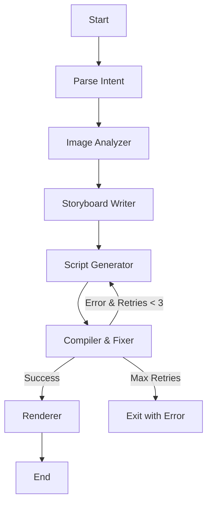

# FotoOwl AI - Image-to-Video Multiagent Pipeline

## Overview

A LangGraph-powered multiagent system that transforms event photos into personalized video reels using AI. The pipeline analyzes images, creates storyboards, generates Remotion scripts, and renders videos automatically.

## Architecture

### LangGraph Flow



### Five Agents

1. **Image Analyzer** - Analyzes each image using a vision-capable model (Groq's `llama-4-scout-17b-16e-instruct`)
2. **Storyboard Writer** - Creates a structured storyboard with RAG-retrieved style guides
3. **Script Generator** - Generates Remotion TypeScript code with RAG-retrieved API docs
4. **Compiler & Fixer** - Compiles the script and regenerates with error context on failure, up to 3 retries
5. **Renderer** - Triggers the final video render

## Model Selection Rationale

All models are hosted on **Groq Cloud** (groq.com) — chosen for its free developer tier, very low latency, and reliable structured-output support via `langchain-groq`.

| Agent | Model | Reasoning |
|-------|-------|-----------|
| Intent Parser | `llama-3.3-70b-versatile` | Simple structured extraction from a one-line prompt — a general-purpose model is plenty, no need for a vision-capable or more expensive model |
| Image Analyzer | `llama-4-scout-17b-16e-instruct` | Groq's currently supported multimodal model — needed specifically for real image understanding, unlike every other node |
| Storyboard Writer | `llama-3.3-70b-versatile` | Strong reasoning for narrative sequencing; this is the creative bottleneck of the pipeline |
| Script Generator | `llama-3.3-70b-versatile` | Reliable code generation for Remotion TSX, guided by RAG-retrieved API examples |
| Compiler & Fixer | `llama-3.3-70b-versatile` (via Script Generator regeneration) | Fixes are done by regenerating the script with the compiler error injected as context, rather than a separate patch step |

> One text model (`llama-3.3-70b-versatile`) is used for every non-vision node for consistency and reduced complexity; only the Image Analyzer needs the separate vision model, since that's the only node that actually needs to see pixels.

## RAG Design

### Vector Store: ChromaDB (local, no API keys needed — uses Chroma's default local embedding model)

### Collections

1. **style_guides** - Visual treatment descriptions per video style
   - Chunking: One document per style (semantic completeness — pacing, color, and tone need to be read together, not fragmented)
   - Metadata: `style`

2. **remotion_api** - Remotion component usage examples and common error patterns
   - Chunking: One function/component/error-pattern per document, for precise targeted retrieval
   - Metadata: (documents are self-contained; retrieval is by embedding similarity)

### Retrieval Strategy

- Storyboard Writer: retrieves top-2 style guides matching the intent's style/pacing/emotion
- Script Generator: retrieves top-5 API snippets for the components it needs
- Compiler & Fixer: retrieves top-3 API snippets matching the compile error text, injected into the next Script Generator call

## Setup

### Prerequisites

- Python 3.11+
- Node.js 18+ (for Remotion)
- Git
- A free Groq API key: https://console.groq.com/keys

### Installation

```bash
# Clone repository
git clone https://github.com/Tech-wizard18/fotoowl-ai-pipeline.git
cd fotoowl-ai-pipeline

# Create virtual environment
python -m venv venv
source venv/bin/activate  # On Windows: venv\Scripts\activate

# Install Python dependencies
pip install -r requirements.txt

# Install Remotion dependencies
cd remotion
npm install
cd ..

# Setup environment variables
cp .env.example .env
# Edit .env and add your GROQ_API_KEY
```

## Usage

### Run Pipeline

```bash
python main.py --images ./sample_images --prompt "Cinematic wedding reel, slow and emotional, warm tones, minimal text"
```

### Run Tests

```bash
pytest tests/ -v
```

Tests run fully offline — every LLM call is mocked via `unittest.mock.patch`, no API key or flag required.

## Sample Output

Check `output/` folder for:
- `storyboard.json` - Structured storyboard with timing and captions
- `composition.tsx` - Generated Remotion script
- `pipeline_state.json` - Full execution trace
- `reel.mp4` - Rendered video (if successful)

## Known Limitations

1. **Remotion Rendering**: Complex animations may fail on first compilation. The retry loop handles common errors but manual fixes might be needed for edge cases.

2. **Image Quality**: Vision model analysis quality depends on image resolution and clarity.

3. **Style Variety**: Limited to 4 pre-defined style guides. New styles need manual addition to the RAG store.

4. **Image selection**: currently all analyzed images are passed to the Storyboard Writer, which selects a subset via the LLM call itself rather than a separate filtering step.

## Future Improvements

With more time, I would:

- Add music synchronization using tempo detection
- Implement face detection for better framing
- Support custom brand templates and themes
- Add video export format options (vertical/square/horizontal)
- Build a caching layer for repeated image analysis
- Add streaming progress updates
- Split the Compiler & Fixer into a dedicated targeted-patch node rather than full script regeneration

## License

MIT