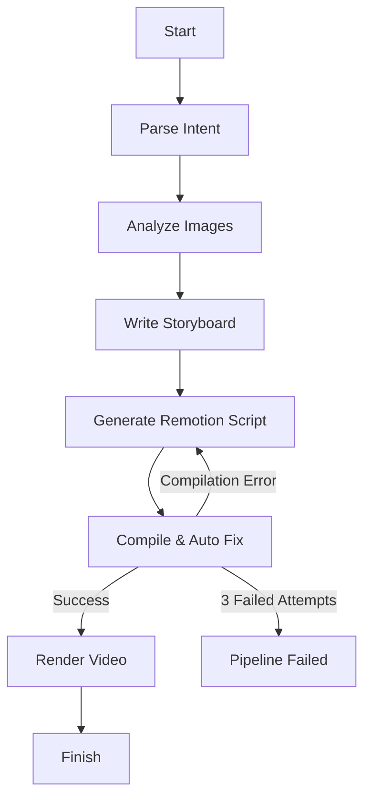

# 🦉 FotoOwl AI – Image-to-Video Multi-Agent Pipeline

## Overview

FotoOwl AI is a LangGraph-powered multi-agent system that transforms a collection of event photos into a cinematic video reel.

The pipeline intelligently analyzes uploaded images, understands the user's creative prompt, generates a storyboard, produces a Remotion video composition, automatically fixes compilation errors, and finally renders the finished MP4 video.

### Features

- 🤖 LangGraph-based multi-agent workflow
- 🧠 AI-powered intent parsing and storyboard generation using Groq LLM
- 🖼️ Image analysis with a vision-capable AI model
- 📚 RAG-powered retrieval using ChromaDB
- 🎬 Automatic Remotion TypeScript generation
- 🔄 Automatic compile-and-fix retry loop
- 🎥 Automatic MP4 video rendering
- 🧪 Unit tests for pipeline components

---

# Architecture

## LangGraph Workflow



---

# Multi-Agent Architecture

The pipeline consists of five AI agents.

### 1. Intent Parser

- Extracts style, pacing and tone from the user prompt.
- Produces structured metadata for downstream agents.

### 2. Image Analyzer

- Understands uploaded images using a vision-capable AI model.
- Identifies scenes, objects and visual context.

### 3. Storyboard Writer

- Generates a complete video storyboard.
- Uses RAG to retrieve relevant cinematic style guides.

### 4. Script Generator

- Converts the storyboard into a Remotion TypeScript composition.
- Uses RAG to retrieve Remotion API examples.

### 5. Compiler & Renderer

- Compiles the generated Remotion code.
- Automatically fixes common compilation errors.
- Retries up to 3 times.
- Renders the final MP4 video.

---

# AI Model Selection

This project uses **Groq Cloud** for low-latency LLM inference.

Groq was selected because it provides:

- Very fast inference
- Reliable structured outputs
- Low latency
- Excellent code generation
- Strong reasoning capabilities
- Free developer tier suitable for this assignment

The same Groq model is used across all pipeline agents for consistency and reduced complexity.

---

# RAG Design

## Vector Database

**ChromaDB**

Local vector database used to provide contextual information to AI agents.

## Collections

### style_guides

Stores cinematic style descriptions.

Metadata:

- style
- pacing
- tone

Used by:

- Storyboard Writer

---

### remotion_api

Stores Remotion API examples.

Metadata:

- component
- category
- usage

Used by:

- Script Generator
- Compiler & Fixer

---

## Retrieval Strategy

### Storyboard Agent

Retrieves:

- Top 2 matching style guides

### Script Generator

Retrieves:

- Top 5 relevant Remotion API examples

### Compiler & Fixer

Retrieves:

- Top 3 API snippets related to the compilation error

---

# Tech Stack

- Python 3.11
- LangGraph
- LangChain
- Groq API
- ChromaDB
- Remotion
- React
- TypeScript
- FFmpeg
- Pytest

---

# Project Structure

```
fotoowl-pipeline/
│
├── src/
├── remotion/
├── sample_images/
├── output/
├── tests/
├── requirements.txt
├── main.py
├── README.md
└── QUICKSTART.md
```

---

# Installation

## Clone Repository

```bash
git clone https://github.com/Tech-wizard18/fotoowl-ai-pipeline.git
cd fotoowl-ai-pipeline
```

## Create Virtual Environment

```bash
python -m venv venv
```

Windows

```bash
venv\Scripts\activate
```

Linux / macOS

```bash
source venv/bin/activate
```

## Install Dependencies

```bash
pip install -r requirements.txt
```

Install Remotion dependencies

```bash
cd remotion
npm install
cd ..
```

---

# Environment Variables

Create a `.env` file.

Example:

```env
GROQ_API_KEY=your_groq_api_key
```

---

# Running the Pipeline

```bash
python main.py --images sample_images --prompt "Cinematic documentary, slow paced, emotional, warm tones"
```

Example Output

```
🦉 FotoOwl AI Pipeline starting...

✓ Intent Parsed
✓ Images Analyzed
✓ Storyboard Generated
✓ Script Generated
✓ Compilation Successful
✓ Video Rendered

Video saved to:

output/reel.mp4
```

---

# Running Tests

```bash
pytest tests/ -v
```

---

# Sample Output

The generated output is stored in the `output/` directory.

Files include:

- storyboard.json
- composition.tsx
- pipeline_state.json
- reel.mp4

---

# Current Limitations

- Image quality directly affects storyboard quality.
- Style guides are currently predefined.
- Retry mechanism handles common compilation issues only.
- Requires a valid Groq API key.
- Rendering speed depends on local hardware.

---

# Future Improvements

- Background music generation
- Voice-over generation
- Face-aware smart framing
- Automatic transition selection
- Brand templates
- Multi-language captions
- Web interface
- Cloud deployment

---

# License

MIT License

---

# Author

**Sanjog**

Built as part of the **FotoOwl AI Engineer Assignment** using LangGraph, Groq, ChromaDB and Remotion.
